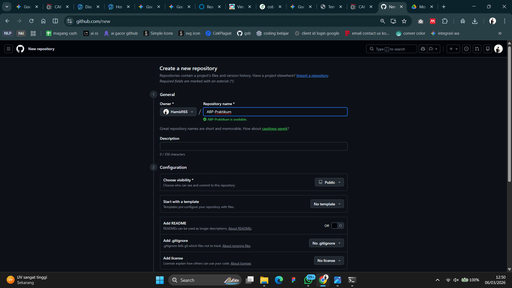
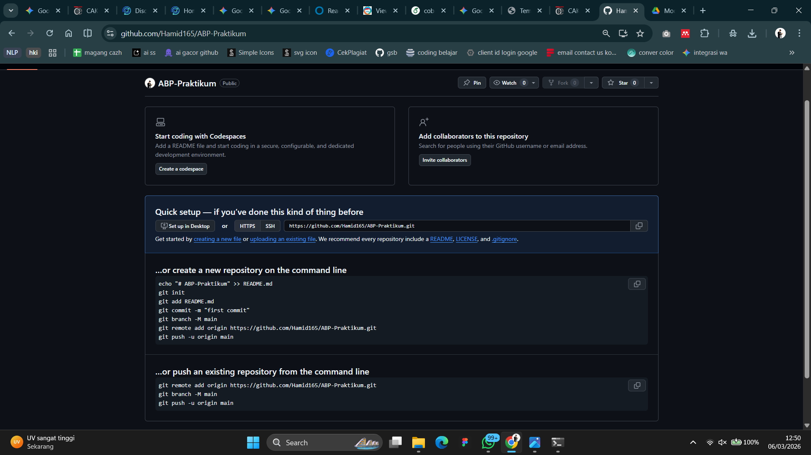
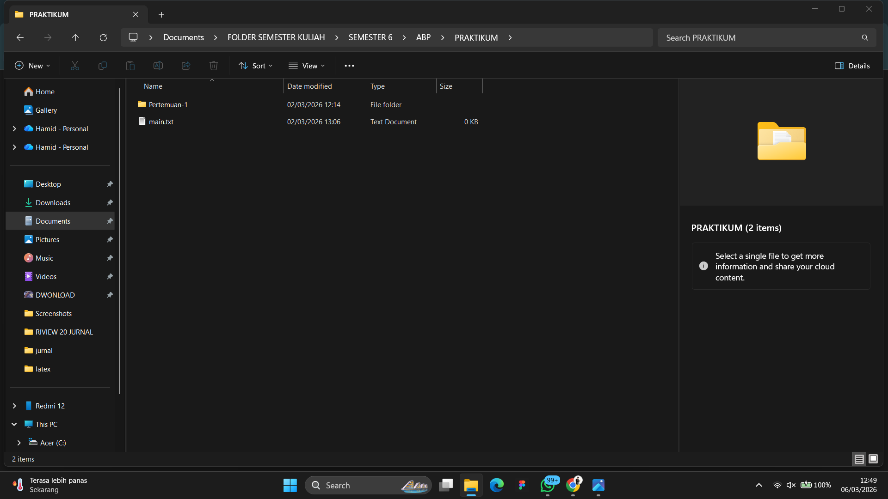
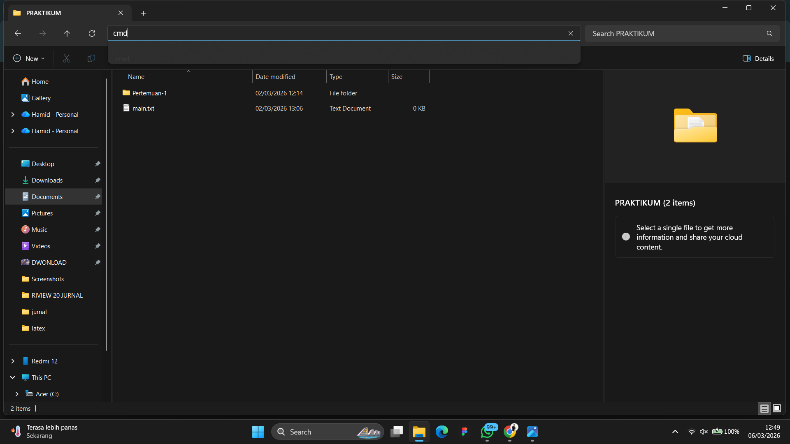
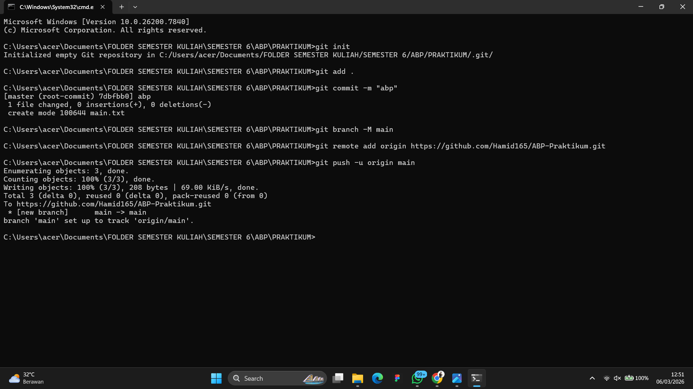
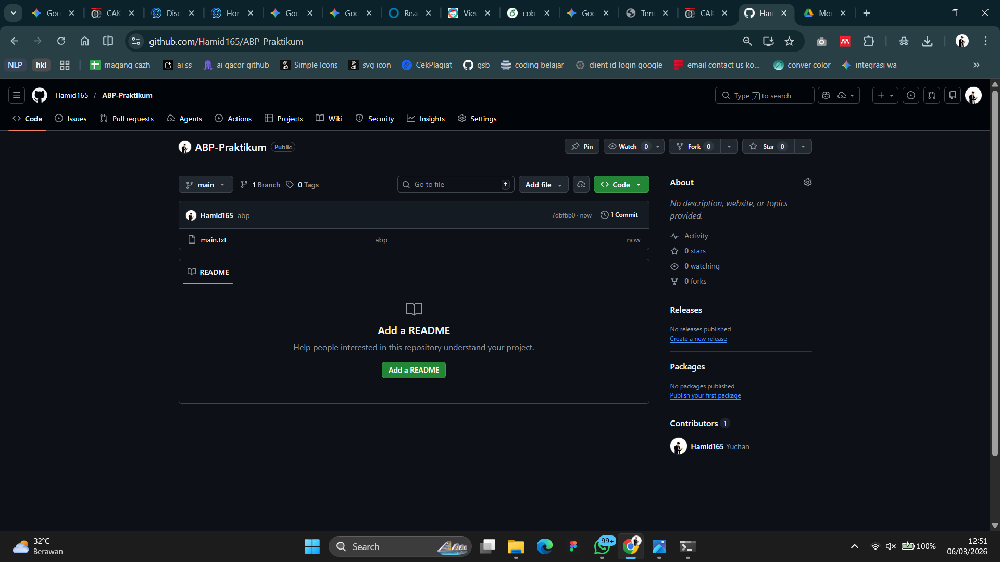



   
  <h1>LAPORAN PRAKTIKUM  APLIKASI BERBASIS PLATFORM</h1>
   
  <h3>MODUL 1   GIT</h3>
   
   
   
   
   
  <h3>Disusun Oleh :</h3>
  

    <strong>HAMID SABIRIN</strong> 
    <strong>2311102129</strong> 
    <strong>S1 IF-11-REG01</strong>
  

   
  <h3>Dosen Pengampu :</h3>
  

    <strong>Dimas Fanny Hebrasianto Permadi, S.ST., M.Kom</strong>
  

   
   
    <h4>Asisten Praktikum :</h4>
    <strong> Apri Pandu Wicaksono </strong>  
    <strong>Rangga Pradarrell Fathi</strong>
   
  <h3>LABORATORIUM HIGH PERFORMANCE
  FAKULTAS INFORMATIKA  UNIVERSITAS TELKOM PURWOKERTO  2026</h3>

---

## 1. Dasar Teori

**Git** adalah sistem pengontrol versi (Version Control System) terdistribusi yang sangat berguna bagi para pengembang perangkat lunak untuk melacak perubahan riwayat file dan mempermudah kolaborasi kode. Sedangkan **GitHub** adalah platform layanan hosting berbasis web untuk repositori Git yang memudahkan kita menyimpan proyek secara online.

**Command Line Interface (CLI)** adalah antarmuka teks di mana pengguna dapat mengetikkan perintah langsung untuk berinteraksi dengan sistem komputer. Dalam praktikum ini, kita menggunakan CLI (seperti Command Prompt atau Terminal) untuk mengeksekusi perintah-perintah Git dengan lebih cepat dan efisien.

---

## 2. Setup Repository via CLI

Berikut adalah urutan langkah-langkah untuk melakukan inisialisasi dan setup repositori dari lokal ke GitHub melalui CLI:

### Langkah 1: Membuat Repositori Baru di GitHub

Langkah pertama yang harus dilakukan adalah membuat repositori atau wadah baru di platform GitHub. Repositori ini nantinya akan bertindak sebagai tempat penyimpanan online untuk kode proyek kita.

### Langkah 2: Panduan Perintah Git

Setelah repositori dibuat, GitHub otomatis akan menampilkan panduan daftar perintah (`command`) yang diperlukan. Perintah-perintah dasar ini yang nantinya akan kita eksekusi di terminal untuk menyambungkan folder lokal komputer ke repositori online.

### Langkah 3: Membuat Folder Proyek dan File

Selanjutnya, kita menyiapkan folder lokal di direktori komputer kita (contohnya menambahkan folder **Pertemuan 1**). Di dalam folder tersebut, buat setidaknya satu file contoh, seperti **main.txt**.

### Langkah 4: Membuka CMD dari Direktori Folder Proyek

Buka Command Prompt (CMD) atau Terminal, kemudian arahkan path atau posisinya agar tepat berada di dalam folder proyek sumber yang tadi telah dibuat. Hal ini ditujukan agar perintah Git nantinya berjalan tepat pada target folder yang sesuai.

### Langkah 5: Menjalankan Perintah Git di Terminal (Push ke GitHub)

Pada tahap ini, kita mengeksekusi semua perintah Git yang tampil dari Langkah 2 secara berurutan. Dimulai dari menginisialisasi Git di folder lokal (`git init`), menambahkan file (`git add`), melakukan commit (`git commit`), menghubungkan tautan remote GitHub, hingga mengunggah kode sumbernya ke online (`git push`).

### Langkah 6: Repositori Berhasil Diperbarui

Jika proses upload (`git push`) pada langkah sebelumnya berjalan sukses dan tanpa kendala, seluruh file dan folder kita kini sudah berhasil terunggah ke repositori GitHub dan siap digunakan untuk kolaborasi lebih lanjut.

## Refrensi
- [Materi Modul 1](https://drive.google.com/file/d/1sAJR4AconN_aZjvLF-GTY0DM-e84pL63/view?usp=sharing)