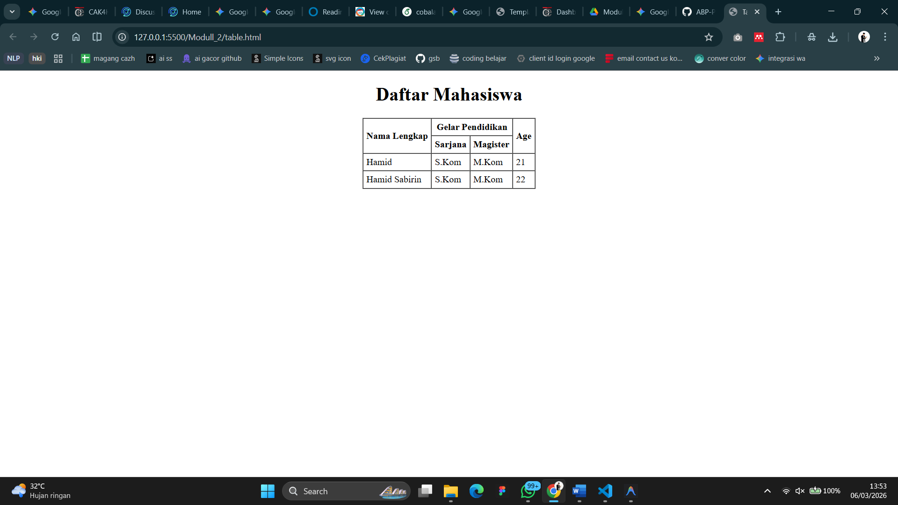

<div align="center">
  <br />
  <h1>LAPORAN PRAKTIKUM <br>APLIKASI BERBASIS PLATFORM</h1>
  <br />
  <h3>MODUL 2 <br> HTML</h3>
  <br />
  <br />
   
  <br />
  <br />
  <br />
  <br />
  <h3>Disusun Oleh :</h3>
  <p>
    <strong>HAMID SABIRIN</strong><br>
    2311102129<br>
    S1 IF-11-REG01
  </p>
  <br />
  <br />
  <h3>Dosen Pengampu :</h3>
  <p>
    <strong>Dimas Fanny Hebrasianto Permadi, S.ST., M.Kom</strong>
  </p>
  <br />
  <br />
  <br />
  <h3>PROGRAM STUDI S1 INFORMATIKA <br>FAKULTAS INFORMATIKA <br>UNIVERSITAS TELKOM PURWOKERTO <br>2025/2026</h3>
</div>

---

## 1. Dasar Teori

**HTML (HyperText Markup Language)** merupakan bahasa markah standar web yang digunakan untuk membuat dan menyusun struktur sebuah halaman website. HTML bekerja menggunakan sederet tag bersarang (nested element) untuk memberi tahu *web browser* bagaimana cara menampilkan elemen teks, gambar, maupun layout secara keseluruhan di layar.

Dalam pembuatan struktur tabel murni memanfaatkan HTML (tanpa bantuan dari *Cascading Style Sheets* atau CSS), kita dapat menggunakan format elemen `<table>` dan didukung oleh tag `<tr>` untuk baris, `<th>` untuk header tabel, serta `<td>` untuk sel data tabel.

HTML juga menyediakan atribut seperti `rowspan` untuk menggabungkan baris dan `colspan` untuk menggabungkan kolom. Atribut lain yang sering digunakan pada sisi presentasi (*meskipun format ini lebih tua*) meliputi `<center>` untuk meratakan konten di tengah dan `border`, `cellpadding`, `cellspacing` pada tag `<table>` untuk mengatur spasi sel dan border batas garis.

---

## 2. Penjelasan Kode HTML

Berikut ini adalah implementasi tabel berdasarkan struktur dasar HTML murni beserta hasil tampilannya.

### Kode HTML (`table.html`)

```html
<!DOCTYPE html>
<html>
<head>
    <title>Tabel Dasar</title>
</head>
<body>
    <!-- Menggunakan tag center murni bawaan HTML, tanpa CSS -->
    <center>
        <table border="1" cellpadding="5" cellspacing="0">
            <tr>
                <th rowspan="2">Nama Lengkap</th>
                <th colspan="2">Gelar Pendidikan</th>
                <th rowspan="2">Age</th>
            </tr>
            <tr>
                <th>Sarjana</th>
                <th>Magister</th>
            </tr>
            <tr>
                <td>Hamid</td>
                <td>S.Kom</td>
                <td>M.Kom</td>
                <td>21</td>
            </tr>
            <tr>
                <td>Hamid Sabirin</td>
                <td>S.Kom</td>
                <td>M.Kom</td>
                <td>22</td>
            </tr>
        </table>
    </center>
</body>
</html>
```

### Hasil Tampilan (Screenshot)



### Penjelasan Eksekusi Kode

Berdasarkan struktur HTML yang telah dibuat, berikut adalah penjelasan teknis mengenai proses rendering HTML di atas:

1. **Tag `<center>`**: Kode diletakkan di dalam tag `<center>` agar seluruh elemen di dalamnya (yakni satu elemen tabel secara utuh) otomatis ditempatkan di bagian tengah layar browser tanpa membutuhkan satu baris pun kode style CSS.
2. **Atribut pada `<table>`**: 
   - `border="1"`: Memberikan batas garis setebal 1 piksel di sekitar semua sel dalam tabel.
   - `cellpadding="5"`: Memberikan ruang spasi sebesar 5 piksel di antara konten teks di dalam sel dengan batas garis tepi selnya.
   - `cellspacing="0"`: Menghilangkan celah ganda di antara satu sel dengan sel lainnya sehingga membuat batas garis tabel tampak lebih rapi (menyatu).
3. **Penggunaan Tag Header (`<th>`) dengan `rowspan` dan `colspan`**:
   - `rowspan="2"` pada bagian `Nama Lengkap` dan `Age`: Karena *baris* untuk header tabel mengambil ruang sebanyak 2 tingkat, maka data tersebut digabungkan sebanyak 2 baris ke bawah.
   - `colspan="2"` pada `Gelar Pendidikan`: *Kolom* Gelar Pendidikan menggabungkan 2 tempat kolom di bagian kiri dan kanan untuk nantinya dapat menampung anak kolom berisikan "Sarjana" dan "Magister" tepat di bagian bawahnya.
4. **Pembagian Data Mahasiswa (`<td>`)**: Sisa baris terakhir diisi dengan isi data aktual profil mahasiswa yang menyisipkan isian 4 kolom sejajar rata ("Hamid", "S.Kom", "M.Kom", dsb). Tiap baris `<tr>` membungkus satu mahasiswa.
