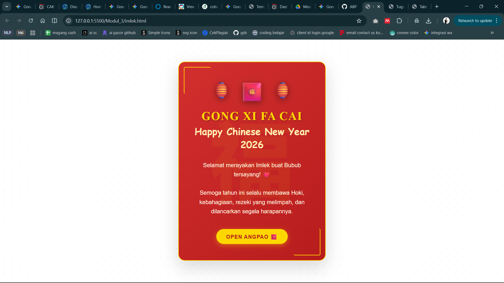

<div align="center">
  <br />
  <h1>LAPORAN PRAKTIKUM <br>APLIKASI BERBASIS PLATFORM</h1>
  <br />
  <h3>MODUL 3 <br> CSS - CASCADING STYLE SHEET</h3>
  <br />
  <br />
   
  <br />
  <br />
  <br />
  <br />
  <h3>Disusun Oleh :</h3>
  <p>
    <strong>HAMID SABIRIN</strong><br>
    2311102129<br>
    S1 IF-11-REG01
  </p>
  <br />
  <br />
  <h3>Dosen Pengampu :</h3>
  <p>
    <strong>Dimas Fanny Hebrasianto Permadi, S.ST., M.Kom</strong>
  </p>
  <br />
  <br />
  <br />
  <h3>PROGRAM STUDI S1 INFORMATIKA <br>FAKULTAS INFORMATIKA <br>UNIVERSITAS TELKOM PURWOKERTO <br>2025/2026</h3>
</div>

---

## 1. Dasar Teori

**CSS (Cascading Style Sheet)** adalah bahasa pendamping HTML yang berfungsi untuk mendesain, mengatur, dan membentuk tampilan pada sebuah halaman website. Jika HTML diibaratkan sebagai kerangka dari sebuah bangunan, maka CSS adalah cat, dekorasi, tata letak, dan desain interior yang memperindah bangunan tersebut.

CSS bekerja dengan cara memilih elemen HTML menggunakan selektor (seperti tag, *class*, atau *id*) lalu menerapkan aturan gaya padanya (properti warna, ukuran, dsb). Penggunaan CSS memungkinkan para pengembang web untuk memisahkan antara konten (HTML) dan desain visual (CSS), sehingga kode menjadi lebih bersih dan lebih mudah dipelihara.

Terdapat tiga cara umum untuk menambahkan CSS ke dalam form HTML:
1. **Inline CSS:** Menuliskan gaya langsung pada elemen HTML secara tertanam menggunakan atribut `style`.
2. **Internal CSS:** Mendeklarasikan aturan gaya di dalam blok `<style>` yang berada di dalam tag `<head>` dokumen.
3. **External CSS:** Menempatkan seluruh aturan gaya dalam file terpisah dengan ekstensi `.css`, kemudian menghubungkannya dengan tag `<link>` di dalam file HTML utamanya. Hal ini adalah *best practice* dalam pemograman web untuk manajemen skala yang lebih besar.

---

## 2. Penjelasan Kode HTML dan CSS

Berikut ini adalah implementasi desain kartu ucapan yang digabungkan antara struktur kerangka dasar HTML murni dan desain modern visual yang diambil dari *External CSS*, beserta hasil tampilannya.

### Kode HTML (`imlek.html`)

```html
<!DOCTYPE html>
<html lang="id">
<head>
    <meta charset="UTF-8">
    <meta name="viewport" content="width=device-width, initial-scale=1.0">
    <title>Gong Xi Fa Cai!</title>
    <link rel="stylesheet" href="style.css">
</head>
<body>

    <div class="card">
        <div class="chinese-char">福</div>
        
        <div class="content-wrapper">
            <div class="decoration">
                <span class="lantern">🏮</span>
                <span class="lantern">🧧</span>
                <span class="lantern">🏮</span>
            </div>
            
            <h1 class="title">Gong Xi Fa Cai</h1>
            <div class="subtitle">Happy Chinese New Year 2026</div>
            
            <p class="message">
                Selamat merayakan Imlek buat Bubub tersayang! ❤️<br><br>
                Semoga tahun ini selalu membawa Hoki, kebahagiaan, rezeki yang melimpah, dan dilancarkan segala harapannya.
            </p>

            <a href="#" class="envelope">Open Angpao 🧧</a>
        </div>
    </div>

</body>
</html>
```

### Kode CSS (`style.css`)

```css
* {
    box-sizing: border-box;
}

body {
    margin: 0;
    padding: 0;
    min-height: 100vh;
    display: flex;
    justify-content: center;
    align-items: center;
    background-color: #ffffff;
    background-image: radial-gradient(#d5d5d5 1px, transparent 1px);
    background-size: 25px 25px;
    font-family: 'Noto Sans SC', sans-serif;
}

.card {
    position: relative;
    width: 450px;
    padding: 50px 40px;
    background: linear-gradient(135deg, #d32f2f 0%, #b71c1c 100%);
    border-radius: 20px;
    box-shadow: 0 20px 50px rgba(0, 0, 0, 0.15);
    text-align: center;
    color: #fff;
    border: 2px solid #ffd700;
    overflow: hidden;
}

.card::before,
.card::after {
    content: '';
    position: absolute;
    width: 80px;
    height: 80px;
    border: 3px solid #ffd700;
    border-radius: 5px;
    opacity: 0.8;
}

.card::before {
    top: 15px;
    left: 15px;
    border-right: none;
    border-bottom: none;
}

.card::after {
    bottom: 15px;
    right: 15px;
    border-left: none;
    border-top: none;
}

.title {
    font-family: 'Cinzel', serif;
    font-size: 2.2em;
    color: #ffd700;
    margin: 20px 0 5px;
    text-transform: uppercase;
    letter-spacing: 2px;
    text-shadow: 2px 2px 4px rgba(0, 0, 0, 0.3);
}

.subtitle {
    font-family: 'Dancing Script', cursive;
    font-size: 1.8em;
    color: #ffecb3;
    margin-bottom: 30px;
    font-weight: 700;
}

.message {
    font-size: 1.1em;
    line-height: 1.6;
    color: #fff8e1;
    margin-bottom: 30px;
    padding: 0 15px;
}

.decoration {
    display: flex;
    justify-content: center;
    gap: 20px;
    font-size: 3.5em;
}

.lantern {
    display: inline-block;
    filter: drop-shadow(0 5px 10px rgba(0, 0, 0, 0.4));
}

.lantern:nth-child(odd) {
    font-size: 0.9em;
}

.chinese-char {
    position: absolute;
    top: 50%;
    left: 50%;
    transform: translate(-50%, -50%);
    font-size: 16em;
    color: rgba(255, 215, 0, 0.06);
    z-index: 0;
    font-weight: bold;
    pointer-events: none;
    line-height: 1;
}

.content-wrapper {
    position: relative;
    z-index: 1;
}

.envelope {
    display: inline-block;
    margin-top: 10px;
    padding: 12px 30px;
    background-color: #ffd700;
    color: #b71c1c;
    text-decoration: none;
    font-weight: bold;
    border-radius: 25px;
    text-transform: uppercase;
    letter-spacing: 1px;
    box-shadow: 0 4px 15px rgba(255, 215, 0, 0.4);
}
```

### Hasil Tampilan (Screenshot)



### Penjelasan code:

- Pada baris **7** (`imlek.html`), HTML memanggil file CSS secara eksternal dengan *linking* pada berkas `style.css` yang memungkinkan elemen terhubungkan ke desain visual tanpa format atribut secara sebaris.
- Pada baris **10-12** (`style.css`), properti di file CSS `display: flex; justify-content: center; align-items: center;` diaplikasikan di dalam elemen *class* `body`. Hal ini berguna secara otomatis akan memposisikan porsi struktur tag tata letak web simetris ada di tengah layang sumbu (baik di garis ukur lebar vertikal dan horizontalnya).
- Pada baris **23-24** (`style.css`), properti perwarnaan visual pendukung `background: linear-gradient()` dipanggil guna memberikan efek gradasi halus rentang transisi warna campuran kemerahan, sedangkan sintaks `border-radius: 20px` mengatur tingkat proporsi lengkungan membulat di keempat sudut kontainer kartu utama antarmuka komponen kartu tersebut.
- Pada baris **34-57** (`style.css`), penambahan penugasan pseudo-elemen CSS `::before` & `::after` secara manual digunakan untuk memberikan slot fungsi injeksi ornamen estetik bingkai kuning pada area pinggir luar komponen `.card` yang dikendalikan khusus tanpa perlu campur tangan di dalam baris file html nya (*markup HTML tetap *clean* tanpa serakan span kosongan*).
- Pada baris **102-113** (`style.css`), properti parameter `position: absolute;` disetel menetap ke struktur `chinese-char` dengan dorongan penempat posisi tengah (`transform: translate(-50%, -50%);`) agar bayangan penokohan huruf mandarin dapat tepat berada presisi sentral di tengah bingkai layar kartu nya. Modul paramater `pointer-events: none;` bertugas menonaktifkan klik mouse di area seleksi khusus tulisan itu sehingga sub elemen teks itu tidak akan menenggelamkan fungsi bagian atas elemen pembaca kartu.
