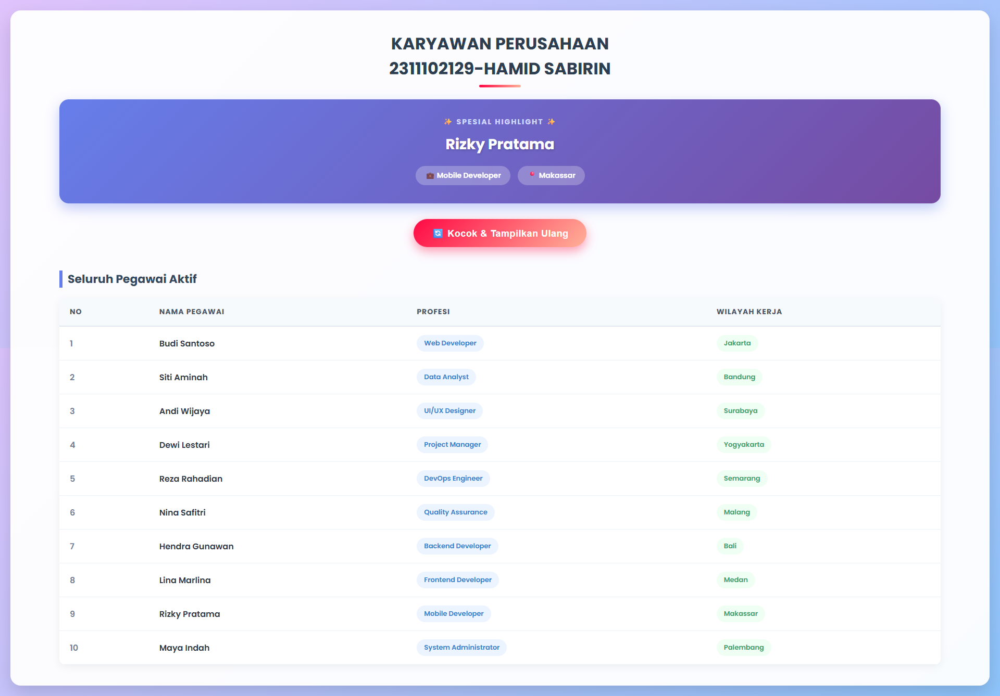

<div align="center">
  <br />
  <h1>LAPORAN PRAKTIKUM <br>APLIKASI BERBASIS PLATFORM</h1>
  <br />
  <h3>TUGAS MODUL 10 <br> AJAX (Asynchronous JavaScript and XML)</h3>
  <br />
  <br />
   
  <br />
  <br />
  <br />
  <br />
  <h3>Disusun Oleh :</h3>
  <p>
    <strong>HAMID SABIRIN</strong><br>
    <strong>2311102129</strong><br>
    <strong>S1 IF-11-REG01</strong>
  </p>
  <br />
  <br />
  <h3>Dosen Pengampu :</h3>
  <p>
    <strong>Dimas Fanny Hebrasianto Permadi, S.ST., M.Kom</strong>
  </p>
  <br />
  <br />
    <h4>Asisten Praktikum :</h4>
    <strong> Apri Pandu Wicaksono </strong> <br>
    <strong>Rangga Pradarrell Fathi</strong>
  <br />
  <h3>LABORATORIUM HIGH PERFORMANCE
 <br>FAKULTAS INFORMATIKA <br>UNIVERSITAS TELKOM PURWOKERTO <br>2026</h3>
</div>

---

## 1. Dasar Teori

**AJAX (Asynchronous JavaScript and XML)** adalah kumpulan teknik pemrograman web yang memungkinkan halaman web untuk mengambil data dari server secara latar belakang (*asynchronously*) tanpa harus memuat ulang (*reload*) seluruh halaman secara penuh. Dengan AJAX, aplikasi web menjadi lebih interaktif, cepat, dan menyerupai aplikasi desktop. Walaupun utamanya mengandung kata "XML", format pertukaran data yang digunakan pada era modern saat ini cenderung lebih bertumpu pada **JSON (JavaScript Object Notation)** karena jauh lebih universal, ringan, dan sejalan langsung dengan sintaks JavaScript bawaan.

Untuk melakukan fungsi pengambilan (*request*) di sisi klien, antarmuka standar modern (API) yang saat ini paling banyak diimplementasikan di berbagai alat peramban (*web browser*) menggantikan `XMLHttpRequest` usang adalah fungsionalitas **`fetch()`**. Fetch API dipuji karena mendukung pengkodingan *Promises* yang memberi kemudahan penanganan sinkronisasi eksekusi HTTP Asynchronous sehingga mempermudah pembacaan, perangkaian `.then()`, dan pemeliharaan struktur kode.

---

## 2. Implementasi Persyaratan Tugas (Kebutuhan Sistem)

Program Sistem Data Karyawan ini telah dirancang untuk memenuhi semua syarat wajib pada soal dengan mengimplementasikan AJAX (*Asynchronous JavaScript and XML*) menggunakan *Fetch API* modern sebagaimana dicontohkan pada cuplikan kode berikut:

### 2.1 Membuat File Server (Database Sederhana) dengan PHP
Data disimpan dalam bentuk array PHP yang berisi informasi nama, pekerjaan, dan lokasi. Data ini kemudian diubah menjadi format JSON menggunakan fungsi `json_encode()`. Header khusus disertakan agar *output* dibaca dengan benar oleh *client* sebagai dokumen JSON. *File Referensi: `data.php`*
```php
<?php
// Menambahkan header agar output terbaca sebagai JSON
header('Content-Type: application/json');

// Membuat array multidimensi berisi 10 data karyawan
$data = [
    ['nama' => 'Budi Santoso', 'pekerjaan' => 'Web Developer', 'lokasi' => 'Jakarta'],
    ['nama' => 'Siti Aminah', 'pekerjaan' => 'Data Analyst', 'lokasi' => 'Bandung'],
    // ... (data lainnya)
];

// Menerjemahkan array PHP ini menjadi bentuk JSON
echo json_encode($data);
?>
```

### 2.2 Mengambil Data Menggunakan Fetch API (AJAX)
Pengambilan data dari *server* dilakukan di sisi *client* menggunakan fungsi bawaan *browser*, yaitu `fetch()`. Proses ini berjalan secara *asynchronous* di latar belakang, sehingga pertukaran data dinamis ini terjadi tanpa *loading* yang mereload/me-refresh halaman web secara keseluruhan. *File Referensi: `index.html`*
```javascript
fetch('data.php')
    .then(response => {
        if (!response.ok) throw new Error('Gagal menghubungi File Backend');
        // Mengonversi respon HTTP mentah ke dalam objek JavaScript (JSON)
        return response.json(); 
    })
    .then(dataArray => {
        semuaDataKaryawan = dataArray; 
        
        // Memanggil fungsi untuk menampilkan data ke UI HTML
        renderTabel(semuaDataKaryawan);
        acakTampilkanSatuProfil();
    });
```

### 2.3 Menampilkan Daftar Data dalam Kolom Tabel HTML
Data *array JSON* yang telah di-*fetch* kemudian di-*looping* menggunakan `forEach` pada JavaScript. Data tersebut kemudian disuntikkan (*inject*) ke dalam kerangka tabel `<tbody id="tabel-pegawai">` secara dinamis menggunakan manipulasi DOM (*Document Object Model*). *File Referensi: `index.html`*
```javascript
function renderTabel(dataList) {
    tbodyTabel.innerHTML = ''; // Membersihkan teks loading
    
    dataList.forEach((orang, index) => {
        const tr = document.createElement('tr'); 
        tr.innerHTML = `
            <td>${index + 1}</td>
            <td>${orang.nama}</td>
            <td><span class="info-badge">${orang.pekerjaan}</span></td>
            <td><span class="lokasi-badge">${orang.lokasi}</span></td>
        `;
        tbodyTabel.appendChild(tr); 
    });
}
```

### 2.4 Pengalokasian Data Profil Secara Dinamis Teracak
Selain mengisi seluruh tabel, sistem ini dirancang cerdas untuk memilih satu indeks dari total *array* secara acak (menggunakan `Math.random()`) dan menyorot profil karyawan terpilih tersebut ke **Banner Highlight** atas. Ini diperbarui secara instan *(seamless)* tiap kali tombol *Reload* ditekan. *File Referensi: `index.html`*
```javascript
function acakTampilkanSatuProfil() {
    // Ambil elemen random
    const angkaAcak = Math.floor(Math.random() * semuaDataKaryawan.length);
    const orangTerpilih = semuaDataKaryawan[angkaAcak];

    // Merender tag HTML secara dinamis
    profilAcakContainer.innerHTML = `
        <strong>✨ Spesial Highlight ✨</strong>
        <p>${orangTerpilih.nama}</p>
        <div>
            <span class="badge">💼 ${orangTerpilih.pekerjaan}</span>
            <span class="badge">📍 ${orangTerpilih.lokasi}</span>
        </div>
    `;
}
```

---

## 3. Penjelasan Kode Sumber (Struktur File & Arsitektur)

Proyek ini sengaja dibuat efisien dengan hanya menggunakan 2 fail dasar (Client-Server) sesuai dengan persyaratan awal soal:

1. **`data.php` (REST API Sederhana / Pseudo-Backend):**  
   Bertindak sebagai "sumber kebenaran" penyuplai data *(Database Provider)*. Script ini memproses *Array Data* menjadi string tipe MIME `application/json` semata.
2. **`index.html` (View HTML, UI, & AJAX Controller):**  
   Titik jumpa (*interface*) interaksi untuk *user* (Front-End). File ini berisi struktur *skelton* div, format pewarnaan desain responsif *CSS* Google Font Poppins dan gradien terang, **Serta memiliki internal *Script JS***. Di dalam script internal di `<head>` (atau *bottom-body*) tersebut tertuang operasi eksekutor *Request Data Server*, sistem penangkap klik tombol *(Event Listener)*, dan penyulapan *(DOM manipulation)* untuk membentuk kerangka tampilan bermakna.  

---

## 4. Hasil Tampilan (Screenshots) Aplikasi AJAX

Berikut adalah lampiran UI / *screenshot* dari Aplikasi Data Pegawai AJAX yang berfungsi merekatkan *backend* PHP ke layan tampil UI secara serentak (*real-time execution*) di lingkungan Web Server Lokal (spt. Laragon/XAMPP).

* Hasil perwajahan aplikasi web secara utuh dan terangkai:



---

## 5. Referensi Web

Laporan praktikum ini disusun mempertimbangkan standar implementasi dan rujukan langsung pada platform-platform ensiklopedia teknologi di bawah:

- **MDN Web Docs - Fetch API (AJAX Asinkron)**: [https://developer.mozilla.org/en-US/docs/Web/API/Fetch_API/Using_Fetch](https://developer.mozilla.org/en-US/docs/Web/API/Fetch_API/Using_Fetch)
- **PHP Documentation - *json_encode***: [https://www.php.net/manual/en/function.json-encode.php](https://www.php.net/manual/en/function.json-encode.php)
- **MDN Web Docs - Basic DOM Manipulation**: [https://developer.mozilla.org/en-US/docs/Learn/JavaScript/Client-side_web_APIs/Manipulating_documents](https://developer.mozilla.org/en-US/docs/Learn/JavaScript/Client-side_web_APIs/Manipulating_documents)
- **CSS Google Fonts SDK (Font Poppins)**: [https://fonts.google.com/specimen/Poppins](https://fonts.google.com/specimen/Poppins)
